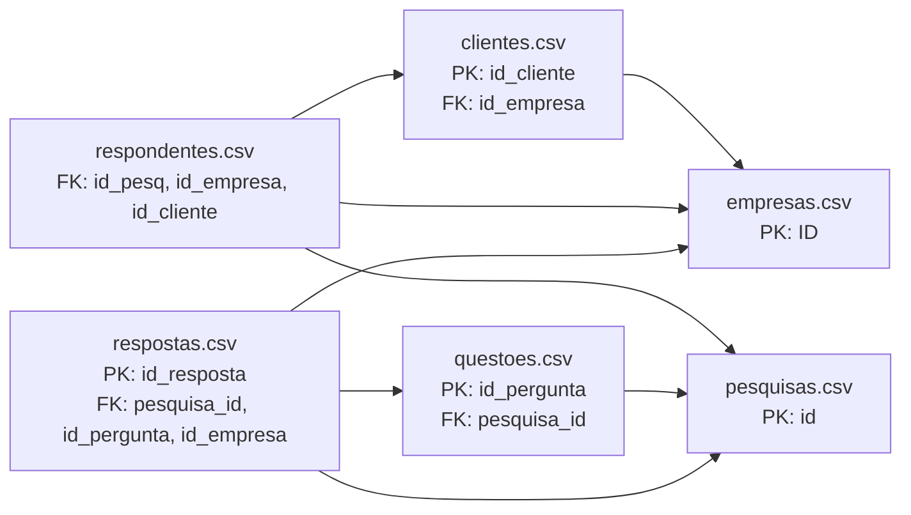

# Inventário das Bases

Esta página concentra a visão estrutural das 6 bases usadas no projeto. O objetivo aqui é mostrar, de forma auditável e operacional, onde estão os arquivos, quais colunas existem em cada dataset, quais chaves permitem ligação entre as tabelas e como são 3 linhas reais de exemplo por base.

## Localização dos Arquivos

| Dataset | Caminho | Registros | Colunas |
| :--- | :--- | ---: | ---: |
| `clientes.csv` | `DADOS/clientes.csv` | 5.430 | 5 |
| `empresas.csv` | `DADOS/empresas.csv` | 779 | 9 |
| `pesquisas.csv` | `DADOS/pesquisas.csv` | 366 | 33 |
| `questoes.csv` | `DADOS/questoes.csv` | 231 | 13 |
| `respondentes.csv` | `DADOS/respondentes.csv` | 18.735 | 6 |
| `respostas.csv` | `DADOS/respostas.csv` | 20.607 | 9 |

## Ligações Entre as Bases

| ID | Relação | Papel da chave | Situação observada |
| :--- | :--- | :--- | :--- |
| `REL-01` | `clientes.id_empresa → empresas.ID` | FK de contato para empresa | íntegra |
| `REL-02` | `questoes.pesquisa_id → pesquisas.id` | FK de pergunta para pesquisa | 4 órfãos (`424`, `1116`, `1139`, `1147`) |
| `REL-03` | `respondentes.id_pesq → pesquisas.id` | FK de participação para pesquisa | 1 órfão (`304`) |
| `REL-04` | `respondentes.id_empresa → empresas.ID` | FK de participação para empresa | íntegra |
| `REL-05` | `respondentes.id_cliente → clientes.id_cliente` | FK de participação para contato | íntegra |
| `REL-06` | `respostas.pesquisa_id → pesquisas.id` | FK de resposta para pesquisa | 4 órfãos (`424`, `1116`, `1139`, `1147`) |
| `REL-07` | `respostas.id_pergunta → questoes.id_pergunta` | FK de resposta para pergunta | íntegra |

## Visão Relacional Resumida

## `clientes.csv`

### Papel Analítico

Cadastro de contatos executivos vinculados a empresas. É a base que permite sair do nível institucional e enxergar cargo, departamento e perfil de quem responde.

### Chaves

| Coluna | Papel |
| :--- | :--- |
| `id_cliente` | PK lógica do contato |
| `id_empresa` | FK para `empresas.ID` |

### Colunas

| Coluna | Papel da chave | Exemplo observado |
| :--- | :--- | :--- |
| `id_cliente` | PK | `s/i` |
| `id_empresa` | FK → `empresas.ID` | `5.0` |
| `cargo` | — | `Especialista` |
| `departamento` | — | `Segurança do Trabalho` |
| `e-mail` | — | `cliente1@empresa5.com` |

### 3 Linhas de Exemplo

| id_cliente | id_empresa | cargo | departamento | e-mail |
|---|---|---|---|---|
| s/i |  |  |  |  |
| 1 | 5.0 | Especialista | Segurança do Trabalho | cliente1@empresa5.com |
| 2 | 215.0 | Analista | Recursos Humanos | cliente2@empresa215.com |

## `empresas.csv`

### Papel Analítico

Cadastro mestre das empresas farmacêuticas. É a base institucional central para associação, geografia e representatividade de mercado.

### Chaves

| Coluna | Papel |
| :--- | :--- |
| `ID` | PK lógica da empresa |

### Colunas

| Coluna | Papel da chave | Exemplo observado |
| :--- | :--- | :--- |
| `ID` | PK | `60` |
| `Nome Fantasia` | — | `Empresa 60` |
| `% de mercado` | — | `8,25%` |
| `Nacionalidade` | — | `Nacional` |
| `Associado` | — | `Sim` |
| `Tipo de Associado` | — | `Efetivo` |
| `Cidade` | — | `São Paulo` |
| `Estado` | — | `São Paulo` |
| `País` | — | `Brasil` |

### 3 Linhas de Exemplo

| ID | Nome Fantasia | % de mercado | Nacionalidade | Associado | Tipo de Associado | Cidade | Estado | País |
|---|---|---|---|---|---|---|---|---|
| 60 | Empresa 60 | 8,25% | Nacional | Sim | Efetivo | São Paulo | São Paulo | Brasil |
| 85 | Empresa 85 | 7,18% | Nacional | Sim | Efetivo | São Paulo | São Paulo | Brasil |
| 62 | Empresa 62 | 6,79% | Nacional | Sim | Efetivo | São Paulo | São Paulo | Brasil |

## `pesquisas.csv`

### Papel Analítico

Base mestre das pesquisas executadas ou cadastradas. É a principal tabela de processo, prazo, status, área, tipo e volume agregado por pesquisa.

### Chaves

| Coluna | Papel |
| :--- | :--- |
| `id` | PK lógica da pesquisa |

### Colunas

| Coluna | Papel da chave | Exemplo observado |
| :--- | :--- | :--- |
| `id` | PK | `49` |
| `titulo` | — | `Transformação Digital 2022` |
| `status` | — | `Finalizada` |
| `tipo` | — | `Pesquisa fixa anual` |
| `area` | — | `Business Support` |
| `participantes` | — | `53.0` |
| `part_mercado` | — | `58%` |
| `data_solicitacao` | — | `22/11/2022` |
| `data_aprov` | — | `05/04/2023` |
| `data_divulgacao` | — | `24/11/2022` |
| `data_limite` | — | `02/12/2022` |
| `prorrogada_ate` | — | `15/03/2023` |
| `data_entrega` | — | `14/10/2022` |
| `dias_uteis_para_entrega` | — | `12.0` |
| `complexidade` | — | `alta` |
| `tipo de resposta` | — | `empresa` |
| `tempo_preenchimento` | — | `4.0` |
| `objetivos` | — | `entender como as indústrias farmacêuticas estruturam sua política para beneficiar colaboradores que são transferidos para outras localidades.` |
| `dia da semana de lançamento` | — | `5.0` |
| `dias úteis aberta` | — | `7.0` |
| `dias entre a solicitação e a divulgação` | — | `2.0` |
| `dias para tabulação` | — | `3.0` |
| `Unnamed: 22` | — | vazio |
| `Unnamed: 23` | — | vazio |
| `Unnamed: 24` | — | vazio |
| `Unnamed: 25` | — | vazio |
| `Unnamed: 26` | — | vazio |
| `Unnamed: 27` | — | vazio |
| `Unnamed: 28` | — | vazio |
| `Unnamed: 29` | — | vazio |
| `Unnamed: 30` | — | vazio |
| `Unnamed: 31` | — | vazio |
| `Unnamed: 32` | — | vazio |

### 3 Linhas de Exemplo

| id | titulo | status | tipo | area | participantes | part_mercado | data_solicitacao | data_aprov | data_divulgacao | data_limite | prorrogada_ate | data_entrega | dias_uteis_para_entrega | complexidade | tipo de resposta | tempo_preenchimento | objetivos | dia da semana de lançamento | dias úteis aberta | dias entre a solicitação e a divulgação | dias para tabulação | Unnamed: 22 | Unnamed: 23 | Unnamed: 24 | Unnamed: 25 | Unnamed: 26 | Unnamed: 27 | Unnamed: 28 | Unnamed: 29 | Unnamed: 30 | Unnamed: 31 | Unnamed: 32 |
|---|---|---|---|---|---|---|---|---|---|---|---|---|---|---|---|---|---|---|---|---|---|---|---|---|---|---|---|---|---|---|---|---|
| 49 | Transformação Digital 2022 | Finalizada | Pesquisa fixa anual | Business Support | 53.0 | 58% |  |  |  |  |  | 14/10/2022 |  | alta | empresa |  |  |  |  |  |  |  |  |  |  |  |  |  |  |  |  |  |
| 48 | Premiação da Força de Vendas 2022 | Finalizada | Pesquisa fixa anual | Business Support | 51.0 | 45% |  |  |  |  |  | 11/11/2022 |  | alta | empresa |  |  |  |  |  |  |  |  |  |  |  |  |  |  |  |  |  |
| 1 | Atualização das medidas de prevenção contra COVID-19 | Finalizada | Solicitação de associado | Sindical Trabalhista e RH | 75.0 | 66% | 22/11/2022 |  | 24/11/2022 | 02/12/2022 |  | 07/12/2022 | 12.0 |  | empresa | 4.0 |  | 5.0 | 7.0 | 2.0 | 3.0 |  |  |  |  |  |  |  |  |  |  |  |

## `questoes.csv`

### Papel Analítico

Cadastro de perguntas por pesquisa. É a base que define o instrumento, o tipo de questão e o grau de confiança da extração.

### Chaves

| Coluna | Papel |
| :--- | :--- |
| `id_pergunta` | PK lógica da pergunta |
| `pesquisa_id` | FK para `pesquisas.id` |

### Colunas

| Coluna | Papel da chave | Exemplo observado |
| :--- | :--- | :--- |
| `id_pergunta` | PK | `1` |
| `pesquisa_id` | FK → `pesquisas.id` | `1147` |
| `pesquisa_titulo` | — | `Tecnologia para a Força de Vendas` |
| `enunciado` | — | `Qual é a faixa aproximada do total de colaboradores no Brasil?` |
| `tipo` | — | `multipla_escolha` |
| `qtd_alternativas` | — | `4.0` |
| `alternativas` | — | `1001 a 3000 | 501 a 1000 | Acima de 3000 | Até 500` |
| `linhas_matriz` | — | `Representantes de visitação médica | Representantes de ponto de venda (PDV) | ...` |
| `colunas_matriz` | — | `Notebook | Tablet | Smartphone | Ipad/Table` |
| `confianca` | — | `alta` |
| `formato_arquivo` | — | `new` |
| `col_origem` | — | `20` |
| `observacoes` | — | vazio |

### 3 Linhas de Exemplo

| id_pergunta | pesquisa_id | pesquisa_titulo | enunciado | tipo | qtd_alternativas | alternativas | linhas_matriz | colunas_matriz | confianca | formato_arquivo | col_origem | observacoes |
|---|---|---|---|---|---|---|---|---|---|---|---|---|
| 1 | 1147 | Tecnologia para a Força de Vendas | Qual é a faixa aproximada do total de colaboradores no Brasil? | multipla_escolha | 4.0 | 1001 a 3000 / 501 a 1000 / Acima de 3000 / Até 500 |  |  | alta | new | 20 |  |
| 2 | 1147 | Tecnologia para a Força de Vendas | Sua empresa possui colaboradores que atuam na Força de Vendas? | multipla_escolha | 2.0 | Não / Sim |  |  | alta | new | 21 |  |
| 3 | 1147 | Tecnologia para a Força de Vendas | Qual é o número total de colaboradores que compõem a Força de Vendas da empresa? | multipla_escolha | 6.0 | Acima de 500 / Até 100 / De 101 a 200 / De 201 a 300 / De 301 a 400 / De 401 a 500 |  |  | alta | new | 22 |  |

## `respondentes.csv`

### Papel Analítico

Registro de participação por empresa em uma pesquisa. É a espinha dorsal do relacionamento entre empresa, pesquisa e contato respondente.

### Chaves

| Coluna | Papel |
| :--- | :--- |
| `id_pesq` | FK para `pesquisas.id` |
| `id_empresa` | FK para `empresas.ID` |
| `id_cliente` | FK para `clientes.id_cliente` |

### Colunas

| Coluna | Papel da chave | Exemplo observado |
| :--- | :--- | :--- |
| `id_pesq` | FK → `pesquisas.id` | `414` |
| `hora_inicio` | — | `16/03/2026 18:58` |
| `hora_termino` | — | `16/03/2026 19:05` |
| `id_empresa` | FK → `empresas.ID` | `1043` |
| `market_share` | — | `0,00%` |
| `id_cliente` | FK → `clientes.id_cliente` | `48` |

### 3 Linhas de Exemplo

| id_pesq | hora_inicio | hora_termino | id_empresa | market_share | id_cliente |
|---|---|---|---|---|---|
| 414 | 16/03/2026 18:58 | 16/03/2026 19:05 | 1043 | 0,00% | 48 |
| 414 | 10/03/2026 15:46 | 10/03/2026 15:51 | 610 | 0,00% | 531 |
| 414 | 10/03/2026 16:53 | 10/03/2026 16:59 | 47 | 0,38% | 883 |

## `respostas.csv`

### Papel Analítico

Microdado de resposta por pergunta. É a base mais granular do projeto e sustenta benchmark, distribuição de alternativas e análises por item do questionário.

### Chaves

| Coluna | Papel |
| :--- | :--- |
| `id_resposta` | PK lógica da resposta |
| `pesquisa_id` | FK para `pesquisas.id` |
| `id_pergunta` | FK para `questoes.id_pergunta` |
| `id_empresa` | FK para `empresas.ID` |

### Colunas

| Coluna | Papel da chave | Exemplo observado |
| :--- | :--- | :--- |
| `id_resposta` | PK | `1` |
| `pesquisa_id` | FK → `pesquisas.id` | `1147` |
| `id_pergunta` | FK → `questoes.id_pergunta` | `1` |
| `respondent_id` | — | `115137090018` |
| `id_empresa` | FK → `empresas.ID` | `6.0` |
| `alternativa` | — | `Representantes de visitação médica` |
| `linha_matriz` | — | `Representantes de visitação médica` |
| `coluna_matriz` | — | `Notebook` |
| `valor` | — | `1001 a 3000` |

### 3 Linhas de Exemplo

| id_resposta | pesquisa_id | id_pergunta | respondent_id | id_empresa | alternativa | linha_matriz | coluna_matriz | valor |
|---|---|---|---|---|---|---|---|---|
| 1 | 1147 | 1 | 115137090018 | 6.0 |  |  |  | 1001 a 3000 |
| 2 | 1147 | 1 | 115136982061 | 8.0 |  |  |  | 1001 a 3000 |
| 3 | 1147 | 1 | 115138578930 | 142.0 |  |  |  | 501 a 1000 |
