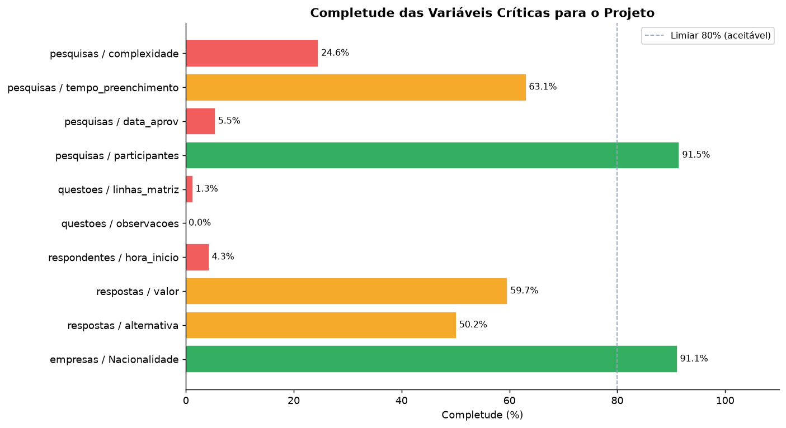
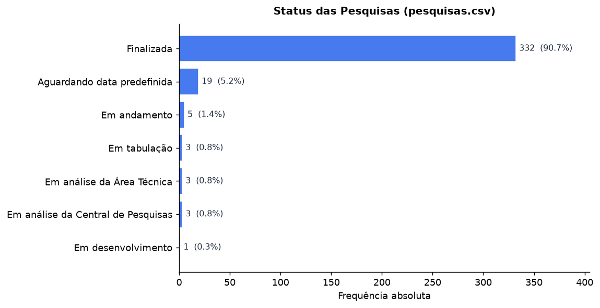
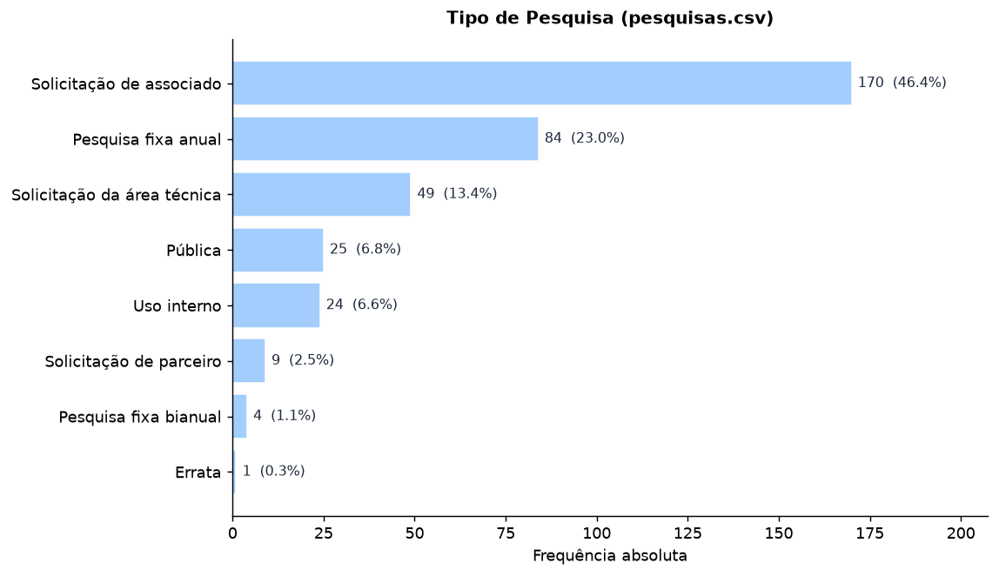
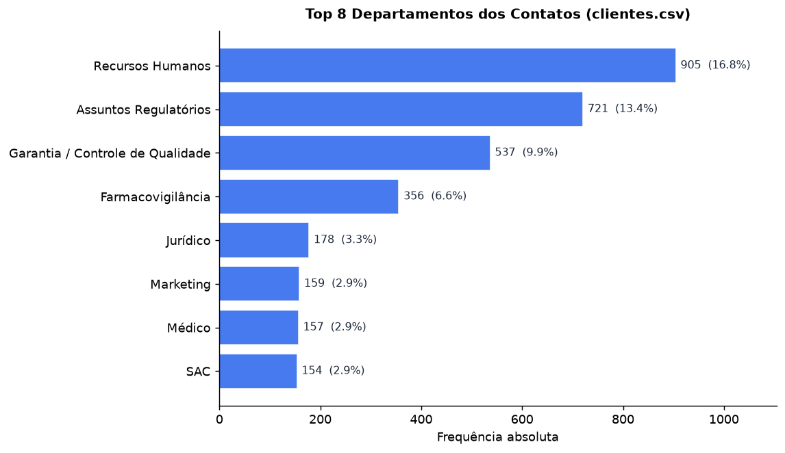
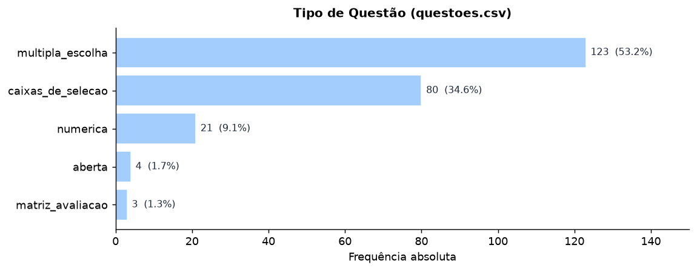
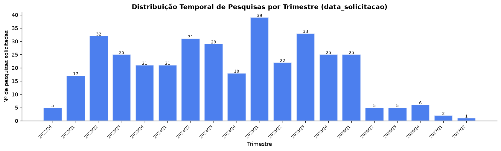
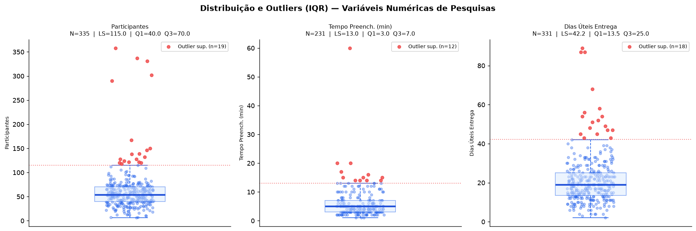

# Modelagem Quantitativa dos Dados do Parceiro Sidusfarma

Este relatório consolida a leitura quantitativa das 6 bases relacionais do parceiro com foco em qualidade de dados, estrutura analítica, indicadores e viabilidade dos relatórios previstos no artefato. As bases brutas analisadas estão em `DADOS/`, os cálculos são reprodutíveis a partir dos scripts em `scripts/data_quality/`, `scripts/metrics/` e `scripts/runners/`, os resultados persistidos desta análise estão em `docs/data/`, e a auditoria segue critérios do DAMA-DMBOK [1](#ref-1).

---

## 0. Resumo Executivo

| Escopo | Valor |
| :--- | ---: |
| Bases auditadas | 6 |
| Registros analisados | 46.148 |
| Colunas analisadas | 75 |
| KPIs materializados | 41 |
| Lacunas relevantes | 12 |
| Reports avaliados | 12 |

| Diagnóstico executivo | Status | Detalhe |
| :--- | :---: | :--- |
| [Qualidade dos dados](#3-qualidade-dos-dados) | Média | completude geral de **77,61%** e **3 relações com órfãos** |
| [Viabilidade analítica](#viabilidade-dos-relatorios) | Alta | maioria dos reports é executável com a base atual |
| [Pontos fortes](#5-indicadores-de-negócio) | Forte | volume, adesão, perfil, acervo e tendência |
| [Pontos de atenção](catalogo_reports/relatorio_02.md) | Atenção | prazo/SLA detalhado, `complexidade`, etapas intermediárias |
| [Prioridade imediata](#35-integridade-referencial) | Alta | saneamento das lacunas e tratamento dos órfãos |

| Decisão executiva | Leitura rápida |
| :--- | :--- |
| Avançar agora | reports de produção, comparativo temporal, perfil, engajamento e acervo |
| Avançar com ressalva | prazo/SLA detalhado e benchmark semântico por pergunta |
| Aprofundar nos detalhes | [Inventário das Bases](inventario_das_bases.md), [Lacunas](#34-inconsistencias-e-lacunas-de-preenchimento), [Integridade Referencial](#35-integridade-referencial) e [Indicadores](#5-indicadores-de-negócio) |

---

## 1. Contextualização Quantitativa

### 1.1 Processo Representado

As bases de dados representam a operação ponta a ponta da Central de Pesquisas Setoriais do Sidusfarma: o fluxo que começa com o cadastro de empresas farmacêuticas e seus contatos executivos, passa pela solicitação, elaboração e lançamento de pesquisas setoriais, e termina na tabulação de respostas e divulgação dos relatórios consolidados ao setor. A principal unidade de análise adotada neste relatório é o **registro de participação** (`respondentes.csv`), porque ele conecta uma empresa a uma pesquisa específica e sustenta os principais indicadores de adesão e engajamento do modelo relacional.

### 1.2 Decisões que Podem Ser Apoiadas por esta Análise

As bases já permitem apoiar decisões práticas do parceiro, tanto no desenho das pesquisas quanto na gestão operacional da Central.

- **Planejamento do catálogo anual:** com 170 pesquisas de "Solicitação de associado" e 84 "Pesquisas fixas anuais", o portfólio é majoritariamente endógeno; isso ajuda a definir quais temas devem entrar no calendário recorrente.
- **Revisão do tamanho dos questionários:** `tempo_preenchimento` tem mediana de 5 minutos e máximo de 60 minutos; questionários muito longos podem ser revistos quando o objetivo for elevar adesão ou reduzir atrito.
- **Priorização da base associativa:** a adesão sobre a base total é 53,79%, mas sobe para 68,35% quando o universo passa a ser apenas as associadas; isso muda a estratégia de relacionamento e cobrança de participação.
- **Instrumentação do processo de coleta:** `hora_inicio` e `hora_termino` estão praticamente vazios; sem isso, o parceiro não mede abandono, horário de pico nem tempo real de resposta por participante.
- **Melhoria do controle operacional:** `complexidade`, `data_aprov` e `prorrogada_ate` existem, mas o uso é inconsistente; isso limita análises de gargalo e SLA e indica necessidade de padronização no sistema de origem.

### 1.3 Inventário Estrutural das Bases

O inventário completo das 6 bases, com todas as colunas, exemplos de 3 linhas por dataset e ligações possíveis entre as tabelas, está em [Inventário das Bases](inventario_das_bases.md). Essa página passa a ser a referência estrutural do projeto para leitura do schema físico e dos joins possíveis.

---

## 2. Unidades de Análise e Taxonomia de Variáveis

### 2.1 Mapeamento das Unidades de Análise

| Dataset | Unidade de Análise | O que representa cada linha | Registros |
| :--- | :--- | :--- | ---: |
| `clientes.csv` | Contato Executivo | Profissional cadastrado vinculado a uma empresa | 5.430 |
| `empresas.csv` | Empresa Farmacêutica | Organização do setor cadastrada no Sidusfarma | 779 |
| `pesquisas.csv` | Instrumento de Pesquisa | Pesquisa setorial solicitada, em andamento ou concluída | 366 |
| `questoes.csv` | Item do Questionário | Pergunta individual pertencente a um instrumento | 231 |
| `respondentes.csv` | Registro de Participação | Participação de uma empresa em uma pesquisa | 18.735 |
| `respostas.csv` | Microdado de Resposta | Resposta de um respondente a uma questão específica | 20.607 |

### 2.2 Taxonomia de Variáveis

As variáveis abaixo foram priorizadas por três critérios combinados: completude mínima, vínculo direto com os [indicadores de negócio](#5-indicadores-de-negócio) e capacidade de segmentar ou explicar comportamento operacional.

| Dataset | [Variável](#glossário) | [Tipo Matemático](#glossário) | [Domínio](#glossário) | O que representa | Relevância para o projeto |
| :--- | :--- | :--- | :--- | :--- | :--- |
| `pesquisas` | `status` | Categórica nominal | {Finalizada, Em andamento, Em tabulação, ...} | estágio atual da pesquisa | base de [KPI-02](#kpi-02) e dos [reports 01](catalogo_reports/relatorio_01.md) e [03](catalogo_reports/relatorio_03.md) |
| `pesquisas` | `tipo` | Categórica nominal | {Solicitação de associado, Pesquisa fixa anual, ...} | origem da demanda | segmentação central dos [reports 01](catalogo_reports/relatorio_01.md) e [11](catalogo_reports/relatorio_11.md) e do recorte de [KPI-02](#kpi-02) |
| `pesquisas` | `area` | Categórica nominal | {RH, Regulatórios, Business Support, ...} | área temática ou demandante | composição temática dos [reports 01](catalogo_reports/relatorio_01.md), [05](catalogo_reports/relatorio_05.md) e [12](catalogo_reports/relatorio_12.md) |
| `pesquisas` | `participantes` | Numérica discreta | [6, 358] | quantidade de participantes por pesquisa | base de [KPI-03](#kpi-03) e da leitura de engajamento no [report 06](catalogo_reports/relatorio_06.md) |
| `pesquisas` | `tempo_preenchimento` | Numérica contínua | [1, 60] min | duração média estimada do questionário | base de [KPI-07](#kpi-07) e do bloco de esforço do respondente no [report 07](catalogo_reports/relatorio_07.md) |
| `pesquisas` | `dias_uteis_para_entrega` | Numérica contínua | [2, 89] dias | prazo operacional até entrega/divulgação | base de [KPI-08](#kpi-08) e dos blocos de SLA dos [reports 02](catalogo_reports/relatorio_02.md) e [03](catalogo_reports/relatorio_03.md) |
| `pesquisas` | `data_solicitacao` | Temporal | dd/mm/aaaa | data de abertura da demanda | eixo temporal dos [reports 01](catalogo_reports/relatorio_01.md), [09](catalogo_reports/relatorio_09.md), [11](catalogo_reports/relatorio_11.md) e [12](catalogo_reports/relatorio_12.md) |
| `pesquisas` | `complexidade` | Categórica ordinal | {baixa, média, alta} | dificuldade estimada da pesquisa | segmentação prevista nos [reports 02](catalogo_reports/relatorio_02.md) e [05](catalogo_reports/relatorio_05.md) |
| `pesquisas` | `dias úteis aberta` | Numérica discreta | [1, 31] | permanência da pesquisa aberta | detalhamento de janela de coleta no [report 02](catalogo_reports/relatorio_02.md) |
| `pesquisas` | `dias para tabulação` | Numérica contínua | [1, 56] | tempo consumido na tabulação | bloco de gargalo operacional do [report 02](catalogo_reports/relatorio_02.md) |
| `pesquisas` | `dias entre a solicitação e a divulgação` | Numérica contínua | [2, 89] | ciclo total da pesquisa | visão de ciclo dos [reports 02](catalogo_reports/relatorio_02.md) e [03](catalogo_reports/relatorio_03.md) |
| `empresas` | `Associado` | Categórica nominal | {Sim, Não} | vínculo associativo | base de [KPI-04](#kpi-04), [KPI-05](#kpi-05), [KPI-06](#kpi-06) e da segmentação do [report 06](catalogo_reports/relatorio_06.md) |
| `empresas` | `% de mercado` | Categórica textual numérica | percentuais textuais | participação estimada de mercado | representatividade dos [reports 09](catalogo_reports/relatorio_09.md) e [10](catalogo_reports/relatorio_10.md) |
| `empresas` | `Nacionalidade` | Categórica nominal | valores institucionais observados | perfil institucional da empresa | composição do [report 08](catalogo_reports/relatorio_08.md) |
| `clientes` | `cargo` | Categórica nominal | títulos livres | papel do respondente | perfil de respondentes no [report 08](catalogo_reports/relatorio_08.md) e apoio ao benchmark do [report 10](catalogo_reports/relatorio_10.md) |
| `clientes` | `departamento` | Categórica nominal | áreas funcionais | área interna do contato | perfil funcional no [report 08](catalogo_reports/relatorio_08.md) e concentração usada em KPI complementar |
| `questoes` | `tipo` | Categórica nominal | {multipla_escolha, caixas_de_selecao, numerica, aberta, matriz_avaliacao} | formato da pergunta | define comparabilidade do [report 07](catalogo_reports/relatorio_07.md) e do [report 10](catalogo_reports/relatorio_10.md) |
| `questoes` | `confianca` | Categórica ordinal | {alta, média, baixa} | grau de confiança atribuído à pergunta | núcleo do [report 04](catalogo_reports/relatorio_04.md) |
| `questoes` | `qtd_alternativas` | Numérica discreta | inteiros não negativos | quantidade de alternativas por questão | leitura de complexidade do instrumento no [report 07](catalogo_reports/relatorio_07.md) |

#### Mapeamento Completo do Schema
O mapeamento completo do schema está em [Inventário das Bases](inventario_das_bases.md).

---

## 3. Qualidade dos Dados

A auditoria foi conduzida com base nos critérios DAMA-DMBOK [1](#ref-1), cobrindo completude, unicidade, integridade referencial e consistência de domínio. O escopo total analisado foi de 46.148 registros distribuídos em 75 colunas.

### 3.1 Boletim de Pontuação DAMA-DMBOK

| Métrica executiva | Valor |
| :--- | ---: |
| Completude geral consolidada | 77,61% |
| Datasets auditados | 6 |
| Registros órfãos em FKs | 9 |
| Duplicatas exatas | 0 |
| Colunas 100% nulas | 12 |

| Dataset | Registros | Colunas | Completude média | Nulos totais | Colunas 100% nulas | Colunas mais críticas |
| :--- | ---: | ---: | ---: | ---: | ---: | :--- |
| `clientes.csv` | 5.430 | 5 | 99,75% | 68 | 0 | `cargo`, `departamento` |
| `empresas.csv` | 779 | 9 | 96,26% | 262 | 0 | `Nacionalidade`, `País`, `Tipo de Associado` |
| `pesquisas.csv` | 366 | 33 | 54,94% | 5.442 | 11 | `data_aprov`, `complexidade`, `tempo_preenchimento` |
| `questoes.csv` | 231 | 13 | 75,33% | 741 | 1 | `observacoes`, `linhas_matriz`, `colunas_matriz` |
| `respondentes.csv` | 18.735 | 6 | 67,34% | 36.717 | 0 | `hora_inicio`, `hora_termino`, `id_cliente` |
| `respostas.csv` | 20.607 | 9 | 72,07% | 51.791 | 0 | `linha_matriz`, `coluna_matriz`, `alternativa` |

### 3.2 Completude Geral

| Dataset | Registros | Colunas | Completude Média | Duplicatas | Colunas 100% Nulas |
| :--- | ---: | ---: | ---: | ---: | ---: |
| `clientes.csv` | 5.430 | 5 | 99,75% | 0 | 0 |
| `empresas.csv` | 779 | 9 | 96,26% | 0 | 0 |
| `pesquisas.csv` | 366 | 33 | 54,94% | 0 | 11 |
| `questoes.csv` | 231 | 13 | 75,33% | 0 | 1 |
| `respondentes.csv` | 18.735 | 6 | 67,34% | 0 | 0 |
| `respostas.csv` | 20.607 | 9 | 72,07% | 0 | 0 |
| **Total** | **46.148** | **75** | **77,61%** | **0** | **12** |

### 3.3 Completude das Variáveis Críticas e Impacto nos Indicadores

Chamamos de **variáveis críticas** as variáveis sem as quais um ou mais indicadores não podem ser calculados ou segmentados de forma confiável.

| Variável | O que representa | Por que é crítica | Completude | Impacto nos indicadores e relatórios |
| :--- | :--- | :--- | ---: | :--- |
| `pesquisas.status` | estágio atual da pesquisa | define conclusão e funil macro | 100,0% | taxa de conclusão com cobertura total |
| `pesquisas.participantes` | volume de participantes por pesquisa | sustenta adesão média por pesquisa | 91,5% | indicadores de engajamento ficam parcialmente subestimados |
| `pesquisas.dias_uteis_para_entrega` | prazo operacional total | sustenta SLA e atraso | 90,4% | relatórios de prazo precisam de aviso de cobertura parcial |
| `pesquisas.tempo_preenchimento` | duração média do questionário | mede esforço do respondente | 63,1% | relatórios de usabilidade e esforço cobrem só parte da base |
| `pesquisas.complexidade` | dificuldade estimada da pesquisa | permitiria comparar prazo e carga por dificuldade | 24,6% | fragiliza relatórios por complexidade |
| `pesquisas.data_aprov` | data de aprovação formal | sustentaria etapa intermediária do ciclo | 5,5% | enfraquece o report de ciclo de vida |
| `respondentes.hora_inicio` / `hora_termino` | marcações reais de início e fim | permitiriam tempo individual de resposta | 4,3% | inviabilizam análise real de abandono e ritmo |
| `empresas.% de mercado` | participação estimada de mercado | sustenta representatividade do setor | 100,0% preenchido | exige validação semântica por concentração de `0,00%` |

### 3.4 Inconsistências e Lacunas de Preenchimento

As lacunas abaixo são relevantes porque afetam cálculo, interpretação ou credibilidade dos indicadores e dos relatórios.

| ID | Problema ou lacuna | Evidência | Como pode afetar indicadores e relatórios | Tratamento recomendado |
| :--- | :--- | :--- | :--- | :--- |
| `LAC-01` | Heterogeneidade em `Associado` | aparecem `Sim`, `sim` e `-` | distorce filtros e segmentações de associação | normalizar para `{Sim, Não}` na ingestão |
| `LAC-02` | `complexidade` muito incompleta | 90 de 366 registros válidos | enfraquece os relatórios 02 e 05 e qualquer leitura de prazo por dificuldade | manter como lacuna explícita; não usar como segmentador central |
| `LAC-03` | `data_aprov` quase vazia | 20 de 366 registros válidos | torna o relatório 03 apenas parcialmente viável | tratar como lacuna de processo |
| `LAC-04` | `hora_inicio` e `hora_termino` quase vazios | 4,3% de completude | impede medir abandono, horário de pico e tempo real por respondente | recomendar captura sistemática |
| `LAC-05` | `prorrogada_ate` sem flag binária nativa | há data final, mas não um campo `teve_prorrogacao` | complica contagens simples de prorrogação e leitura do relatório 02 | derivar campo booleano na camada analítica |
| `LAC-06` | Ausência de cancelamento explícito | não há `data_cancelamento` nem `motivo_encerramento` | a taxa de conclusão pode parecer melhor do que o processo real | tratar como lacuna de processo |
| `LAC-07` | `participantes` ausente em 31 pesquisas | 335 de 366 registros válidos | reduz cobertura de métricas de engajamento | avisar cobertura parcial |
| `LAC-08` | `tempo_preenchimento` ausente em 135 pesquisas | 231 de 366 registros válidos | reduz robustez das métricas de esforço do respondente | usar cobertura explícita |
| `LAC-09` | `dias_uteis_para_entrega` ausente em 35 pesquisas | 331 de 366 registros válidos | afeta SLA, prazos e listas de atraso | manter aviso de cobertura parcial |
| `LAC-10` | 11 colunas `Unnamed` em `pesquisas.csv` | 100% nulas e sem significado analítico | poluem o schema e confundem leitura técnica | eliminar totalmente na Staging |
| `LAC-11` | `questoes.observacoes` sem uso | 0 de 231 registros válidos | aumenta ruído sem agregar valor | manter fora do escopo analítico |
| `LAC-12` | `% de mercado` concentrado em `0,00%` | 619 de 779 empresas com `0,00%` | pode achatar leitura de representatividade | validar com o parceiro o significado de zero |

### 3.5 Integridade Referencial

Foram verificadas 7 relações de chave estrangeira. Quatro estão íntegras e três apresentam registros órfãos que precisam ser tratados antes da automação mais pesada dos KPIs.

#### Relações Auditadas

| Grupo | Quantidade | Leitura |
| :--- | ---: | :--- |
| Relações auditadas | 7 | conjunto total de vínculos PK/FK verificados entre as 6 bases |
| Relações íntegras | 4 | podem ser usadas em joins sem perda por órfãos |
| Relações com órfãos | 3 | exigem saneamento, quarentena ou aviso explícito de cobertura |

| Relação | Órfãos | Impacto | Observação |
| :--- | ---: | :---: | :--- |
| `clientes.id_empresa → empresas.ID` | 0 | Nulo | relação íntegra |
| `questoes.pesquisa_id → pesquisas.id` | 4 (`424`, `1116`, `1139`, `1147`) | Médio | há questões apontando para pesquisas inexistentes na tabela-mãe |
| `respondentes.id_empresa → empresas.ID` | 0 | Nulo | relação íntegra |
| `respondentes.id_cliente → clientes.id_cliente` | 0 | Nulo | relação íntegra |
| `respostas.id_pergunta → questoes.id_pergunta` | 0 | Nulo | relação íntegra |
| `respondentes.id_pesq → pesquisas.id` | 1 (`304`) | Médio | infla participação sem pesquisa-mãe correspondente |
| `respostas.pesquisa_id → pesquisas.id` | 4 (`424`, `1116`, `1139`, `1147`) | Médio | respostas podem sumir em joins por tema, área ou tipo |

#### Relações Íntegras

As relações `clientes.id_empresa → empresas.ID`, `respondentes.id_empresa → empresas.ID`, `respondentes.id_cliente → clientes.id_cliente` e `respostas.id_pergunta → questoes.id_pergunta` estão estáveis. Elas sustentam com segurança os recortes institucionais, o vínculo entre participação e contato, e a leitura de microdados por pergunta.

#### Relações com Órfãos

As três relações problemáticas convergem para o mesmo ponto estrutural: há IDs de pesquisa presentes nas tabelas filhas que não aparecem em `pesquisas.csv`. Isso afeta `questoes`, `respondentes` e `respostas`, em graus diferentes.

No caso de `questoes.pesquisa_id → pesquisas.id`, existem 4 IDs órfãos (`424`, `1116`, `1139`, `1147`). Isso enfraquece qualquer análise que tente cruzar questões com `status`, `tipo`, `area`, datas ou prazo da pesquisa. É também uma das razões para [KPI-09](#kpi-09) exigir cautela interpretativa, porque a média de questões por instrumento passa a ser calculada sobre um cadastro de instrumentos incompleto do ponto de vista relacional.

No caso de `respondentes.id_pesq → pesquisas.id`, existe 1 órfão (`304`). O efeito é menor em volume, mas ele ainda pode inflar indicadores de participação e adesão quando o numerador vem de `respondentes` e o denominador ou os segmentadores vêm de `pesquisas`.

No caso de `respostas.pesquisa_id → pesquisas.id`, existem 4 órfãos (`424`, `1116`, `1139`, `1147`). Isso afeta leituras por tema, área, tipo e período da pesquisa, porque parte dos microdados fica sem pesquisa-mãe correspondente em joins analíticos.

#### Impacto nos KPIs

| KPI | Como a integridade referencial afeta a leitura |
| :--- | :--- |
| [KPI-03](#kpi-03) | o órfão em `respondentes` pode inflar levemente a média de participantes por pesquisa |
| [KPI-09](#kpi-09) | questões órfãs reduzem a confiabilidade da média de questões por instrumento quando o denominador vem de `pesquisas.csv` |
| [KPI-10](#kpi-10) | respostas ligadas a pesquisas órfãs podem distorcer a leitura de volume médio por pergunta quando o recorte exige atributos da pesquisa |
| KPIs por `status`, `tipo`, `area` e período | qualquer indicador que dependa de join com `pesquisas.csv` pode subcontar ou excluir linhas órfãs nos recortes |

Os 9 registros órfãos observados nas relações que dependem de `pesquisas.csv` devem ser enviados para quarentena na camada de Staging e registrados no log de limpeza. Eles não inviabilizam a análise global, mas reduzem a confiança em indicadores que dependem de joins completos entre participação, questões, respostas e cadastro de pesquisas.

### 3.6 Viabilidade dos Relatórios com a Base Atual

O detalhamento textual de cada mockup está em [docs/catalogo_reports/README.md](catalogo_reports/README.md). Esses mockups foram fornecidos pelo próprio parceiro após solicitação do orientador Hermano durante o workshop conduzido com o grupo, e por isso hoje são o melhor guia disponível para priorização de estrutura analítica, lacunas de dados e desenho dos relatórios futuros.

| Report | Foco | Status | Leitura técnica da viabilidade |
| :--- | :--- | :--- | :--- |
| [01](catalogo_reports/relatorio_01.md) | Produção & Volume | Viável com a base atual | A base entrega volume, status, tipo, área e recorte temporal. A meta anual prevista no mockup não existe nos CSVs e precisará vir de parametrização externa. |
| [02](catalogo_reports/relatorio_02.md) | Prazos & SLA | Viável com lacunas relevantes | Datas, ciclo total, dias úteis aberta, prorrogação e tabulação existem. O bloco `tempo por complexidade` fica fraco porque `complexidade` está muito incompleta. |
| [03](catalogo_reports/relatorio_03.md) | Ciclo de Vida da Pesquisa | Viável com lacunas relevantes | Solicitação, divulgação e conclusão estão disponíveis. A etapa de aprovação fica frágil porque `data_aprov` quase não é usada. |
| [04](catalogo_reports/relatorio_04.md) | Qualidade & Governança | Viável com a base atual | A base e a auditoria sustentam completude, órfãos, inconsistências e confiança das perguntas. O score sintético de saúde do dado dependerá de regra definida pelo grupo. |
| [05](catalogo_reports/relatorio_05.md) | Carga & Demanda por Área | Viável com lacunas relevantes | A demanda por área é viável. Os blocos de complexidade e `complexidade x prazo` ficam limitados pela baixa cobertura desse campo. |
| [06](catalogo_reports/relatorio_06.md) | Engajamento & Adesão | Viável com a base atual | A base sustenta adesão global, empresas ativas, empresas inativas, recortes geográficos e listas de reengajamento. A régua de “reengajar” precisará ser definida analiticamente. |
| [07](catalogo_reports/relatorio_07.md) | Resultados da Pesquisa | Viável com lacunas relevantes | A base sustenta distribuição de respostas, pergunta-chave e destaques por questão, sobretudo para perguntas fechadas. O limite está nas perguntas abertas e na necessidade de curadoria narrativa. |
| [08](catalogo_reports/relatorio_08.md) | Perfil dos Participantes | Viável com a base atual | A base sustenta nacionalidade, cargo, departamento e distribuição geográfica com joins entre `respondentes`, `clientes` e `empresas`. |
| [09](catalogo_reports/relatorio_09.md) | Representatividade de Mercado | Viável com a base atual | A base sustenta mercado coberto, share dos participantes e comparação temporal. A ressalva é semântica: `% de mercado` precisa ser validado, não por ausência, mas por concentração de zeros. |
| [10](catalogo_reports/relatorio_10.md) | Benchmark Setorial | Viável com lacunas relevantes | A base de microdados permite benchmark, mas o mockup exige padronização por pergunta, definição de indicadores comparáveis e marcação explícita da empresa-alvo. |
| [11](catalogo_reports/relatorio_11.md) | Comparativo Anual & Tendências | Viável com a base atual | A base sustenta série temporal, composição por ano e comparação entre períodos. A definição de “onda” precisa ser padronizada para evitar mistura de recortes não comparáveis. |
| [12](catalogo_reports/relatorio_12.md) | Acervo & Explorador | Viável com a base atual | A base sustenta catálogo, busca por título, filtros por área e por ano. O ganho adicional virá de normalização de tags e temas, não de correção de lacuna estrutural. |

---

## 4. Estatística Descritiva

Foram selecionadas para esta seção as variáveis com completude suficiente e vínculo direto com comportamento operacional, perfil dos participantes ou cálculo de indicadores. Campos abaixo de 25% de preenchimento, como `complexidade`, `data_aprov` e `hora_inicio`, permanecem documentados na seção de qualidade, mas não são tratados aqui como base estatística principal.

### 4.1 Variáveis Categóricas

#### Status das Pesquisas

90,7% das pesquisas registradas atingiram o status "Finalizada", que também é a moda da variável, com 332 registros. Os 9,3% restantes estão distribuídos entre etapas intermediárias do fluxo operacional. Não há registro explícito de cancelamento na base, o que pode indicar que pesquisas canceladas não são registradas ou são excluídas do sistema antes da exportação, uma lacuna de processo a investigar.

#### Tipo de Pesquisa

A demanda é predominantemente endógena: "Solicitação de associado" é a moda da variável, com 170 registros (46,4%), e "Pesquisa fixa anual" aparece em 84 registros (23,0%). Juntas, elas somam 69,4% do catálogo e indicam que a Central opera prioritariamente a serviço da base de associados.

#### Perfil das Empresas: Vínculo Associativo

Após normalização dos valores de `Associado`, a categoria modal é `Sim`, com 613 empresas. Isso corresponde a 78,7% das empresas cadastradas e é central para qualquer análise de engajamento segmentado, especialmente na comparação entre base total e base associada.

#### Departamentos dos Contatos

Recursos Humanos é a moda da variável, com 905 contatos (16,8%), seguido por Assuntos Regulatórios, com 721 (13,4%). Juntos, concentram 30,2% do cadastro e ajudam a explicar quais áreas mais interagem com as pesquisas.

#### Tipo de Questão

87,9% das questões são fechadas (`multipla_escolha` + `caixas_de_selecao`). A moda é `multipla_escolha`, com 123 registros, seguida por `caixas_de_selecao`, com 80. Isso favorece tabulação quantitativa, benchmark e geração de relatórios. As questões abertas são minoria e não inviabilizam a análise, mas podem exigir tratamento textual separado.

### 4.2 Variáveis Numéricas: Tendência Central e Dispersão

| [Variável](#glossário) | N válidos | [Média](#glossário) | [Mediana](#glossário) | Moda | Mínimo | Máximo | [Amplitude](#glossário) | Desvio Padrão | Coef. de Variação |
| :--- | ---: | ---: | ---: | ---: | ---: | ---: | ---: | ---: | ---: |
| `participantes` | 335 | 60,68 | 54,00 | 54,00 | 6 | 358 | 352 | 41,33 | 68,1% |
| `tempo_preenchimento` (min) | 231 | 5,97 | 5,00 | 3,00 | 1 | 60 | 59 | 5,13 | 85,8% |
| `dias_uteis_para_entrega` | 331 | 21,11 | 19,00 | 19,00 | 2 | 89 | 87 | 12,16 | 57,6% |

As três variáveis têm média acima da mediana, indicando assimetria à direita e presença de casos extremos. A amplitude confirma que não existe um “tamanho padrão” de pesquisa nem um único tempo operacional típico para toda a base. Para relatórios executivos, a mediana é mais estável do que a média.

### 4.3 Distribuição Temporal: Volume de Pesquisas Solicitadas por Trimestre

A série temporal mostra a evolução das pesquisas por trimestre. Nesta documentação, o formato `2024Q3` significa **terceiro trimestre de 2024**, em que `Q` vem de *quarter* e é um padrão comum de representação temporal. Esse recorte é útil porque permite cruzar volume com prazo de entrega e detectar sazonalidade operacional.

### 4.4 Valores Extremos: Identificação pelo Método IQR

O método IQR foi adotado por ser não-paramétrico e funcionar bem em distribuições assimétricas [2](#ref-2). Nesta seção, `Q1`, `Q3`, `IQR` e `LS` são usados no sentido estatístico padrão e estão definidos no [Glossário](#glossário).

\[
IQR = Q3 - Q1 \quad|\quad LI = Q1 - 1{,}5 \times IQR \quad|\quad LS = Q3 + 1{,}5 \times IQR
\]

#### Valores Extremos por Variável

**`participantes`**: `Q1 = 40`, `Q3 = 70`, `IQR = 30`, `LS = 115`, 19 valores acima do limite.

Tratamento recomendado: **manter**. Os valores de 290 a 358 respondentes representam pesquisas de alta representatividade e não devem ser tratados como erro só por estarem fora do padrão central.

**`tempo_preenchimento`**: `Q1 = 3`, `Q3 = 7`, `IQR = 4`, `LS = 13`, 12 valores acima do limite.

Tratamento recomendado: **manter com flag analítica**. O outlier mais extremo é 60 minutos; em vez de exclusão, o caso pede segmentação e possível criação de um marcador para questionários longos.

**`dias_uteis_para_entrega`**: `Q1 = 13,5`, `Q3 = 25`, `IQR = 11,5`, `LS = 42,25`, 18 valores acima do limite.

Tratamento recomendado: **manter e investigar**. Esses casos descrevem justamente o atraso que o parceiro precisa enxergar. Para modelagem futura, pode haver tratamento robusto na camada analítica, mas não supressão automática da base.

---

## 5. Indicadores de Negócio

Os indicadores desta seção foram identificados a partir das perguntas de negócio sugeridas pelos 12 mockups de relatórios, das colunas efetivamente disponíveis nas 6 bases e das métricas operacionais, de adesão, perfil, representatividade e microdados que podem ser calculadas sem depender de interpretação subjetiva do conteúdo textual. A organização adotada separa indicadores principais, indicadores complementares universais e indicadores específicos por pergunta.

### 5.1 Indicadores Principais

| ID | Indicador | Pergunta de negócio | Unidade de análise | Fórmula resumida | Variáveis principais | Valor apurado | Limitação principal |
| :--- | :--- | :--- | :--- | :--- | :--- | ---: | :--- |
| KPI-01 | Volume total de pesquisas | Qual o tamanho do catálogo? | Pesquisa | `COUNT(pesquisas.id)` | `pesquisas.id` | 366 | não distingue importância estratégica |
| KPI-02 | Taxa de conclusão | Quantas pesquisas chegam ao fim? | Pesquisa | `Finalizadas / Total × 100` | `pesquisas.status` | 90,71% | cancelamento não é explícito |
| KPI-03 | Média de participantes por pesquisa | Qual o engajamento médio por pesquisa? | Pesquisa | `COUNT(respondentes) / COUNT(pesquisas)` | `respondentes.id_pesq`, `pesquisas.id` | 51,19 | um órfão infla o numerador |
| KPI-04 | Taxa de empresas associadas | Quanto do cadastro é associado? | Empresa | `Associadas / Total × 100` | `empresas.Associado` | 78,69% | exige normalização de rótulos |
| KPI-05 | Taxa de adesão global | Quantas empresas do cadastro já participaram? | Empresa | `Empresas participantes / Total × 100` | `respondentes.id_empresa`, `empresas.ID` | 53,79% | não mede recorrência |
| KPI-06 | Taxa de adesão das associadas | Como a adesão muda na base associada? | Empresa associada | `Empresas participantes / Associadas × 100` | `respondentes.id_empresa`, `empresas.Associado` | 68,35% | não mede intensidade |
| KPI-07 | Tempo médio de preenchimento | Quanto esforço a pesquisa exige? | Pesquisa | `MEAN(tempo_preenchimento)` | `pesquisas.tempo_preenchimento` | 5,97 min | cobertura de 63,1% |
| KPI-08 | Tempo médio de entrega | Quanto tempo a Central leva para entregar? | Pesquisa | `MEAN(dias_uteis_para_entrega)` | `pesquisas.dias_uteis_para_entrega` | 21,11 dias úteis | 35 pesquisas fora do cálculo |
| KPI-09 | Média de questões por instrumento | Qual a extensão média dos questionários? | Pesquisa | `COUNT(questoes) / COUNT(pesquisas)` | `questoes.id_pergunta`, `pesquisas.id` | 0,63 | revela lacuna do cadastro de questões |
| KPI-10 | Média de respostas por pergunta | Qual o volume médio de microdados por questão? | Questão | `COUNT(respostas) / COUNT(questoes)` | `respostas.id_resposta`, `questoes.id_pergunta` | 89,21 | há respostas ligadas a pesquisas órfãs |

### 5.2 Indicadores Complementares Universais

Os indicadores abaixo também são calculáveis com a base atual e ampliam a cobertura analítica do projeto.

| ID lógico | Indicador | Pergunta de negócio | Unidade de análise | Fórmula resumida | Variáveis principais | Observação |
| :--- | :--- | :--- | :--- | :--- | :--- | :--- |
| KPI-11 | Volume de pesquisas no período | Quantas pesquisas houve no ano/trimestre/mês? | Pesquisa | `COUNT(pesquisas por período)` | `data_solicitacao`, `data_divulgacao` | sustenta os [reports 01](catalogo_reports/relatorio_01.md) e [11](catalogo_reports/relatorio_11.md) |
| KPI-12 | Volume de pesquisas finalizadas no período | Quantas finalizações houve no período? | Pesquisa | `COUNT(status = finalizada por período)` | `status`, `data_divulgacao` | operação |
| KPI-13 | Volume de pesquisas em andamento | Quantas pesquisas ainda estão abertas? | Pesquisa | `COUNT(status não final)` | `status` | operação |
| KPI-14 | Crescimento do volume vs. período anterior | O volume cresceu ou caiu? | Período | `((t - t-1) / t-1)` | `data_solicitacao` | tendência temporal do [report 01](catalogo_reports/relatorio_01.md) |
| KPI-15 | Taxa de pesquisas prorrogadas | Qual o peso das prorrogações? | Pesquisa | `COUNT(prorrogada_ate preenchida) / Total` | `prorrogada_ate` | monitoramento de prazo do [report 02](catalogo_reports/relatorio_02.md) |
| KPI-16 | Ciclo mediano da pesquisa | Qual o SLA central mais robusto? | Pesquisa | `MEDIAN(dias entre solicitação e divulgação)` | `dias entre a solicitação e a divulgação` | leitura central de prazo do [report 02](catalogo_reports/relatorio_02.md) |
| KPI-17 | Média de dias úteis aberta | Quanto tempo a pesquisa fica aberta? | Pesquisa | `MEAN(dias úteis aberta)` | `dias úteis aberta` | janela operacional do [report 02](catalogo_reports/relatorio_02.md) |
| KPI-18 | Mediana de dias úteis aberta | Qual o valor central do tempo aberta? | Pesquisa | `MEDIAN(dias úteis aberta)` | `dias úteis aberta` | janela operacional do [report 02](catalogo_reports/relatorio_02.md) |
| KPI-19 | Média de dias para tabulação | Quanto tempo a tabulação consome? | Pesquisa | `MEAN(dias para tabulação)` | `dias para tabulação` | gargalo de tabulação do [report 02](catalogo_reports/relatorio_02.md) |
| KPI-20 | Mediana de dias para tabulação | Qual o valor central da tabulação? | Pesquisa | `MEDIAN(dias para tabulação)` | `dias para tabulação` | gargalo de tabulação do [report 02](catalogo_reports/relatorio_02.md) |
| KPI-21 | Empresas participantes distintas | Quantas empresas ativas existem? | Empresa | `COUNT(DISTINCT id_empresa)` | `respondentes.id_empresa` | base ativa do [report 06](catalogo_reports/relatorio_06.md) |
| KPI-22 | Empresas que nunca participaram | Quantas empresas seguem inativas? | Empresa | `Total empresas - empresas participantes` | `empresas.ID`, `respondentes.id_empresa` | base inativa do [report 06](catalogo_reports/relatorio_06.md) |
| KPI-23 | Participações médias por empresa ativa | Quão recorrente é a participação? | Empresa ativa | `COUNT(participações) / empresas ativas` | `respondentes.id_empresa` | recorrência do [report 06](catalogo_reports/relatorio_06.md) |
| KPI-24 | Empresas recorrentes | Quantas empresas participaram de 2+ pesquisas? | Empresa | `COUNT(empresas com 2+ participações)` | `respondentes.id_empresa`, `id_pesq` | engajamento |
| KPI-25 | Taxa de associadas entre participantes | Entre quem responde, quanto é associado? | Empresa participante | `Associadas participantes / participantes × 100` | `respondentes.id_empresa`, `Associado` | perfil |
| KPI-26 | Cobertura total de mercado das participantes | Quanto do mercado a pesquisa cobre? | Pesquisa/período | `SUM(% mercado participantes)` | `empresas.% de mercado`, `respondentes.id_empresa` | representatividade do [report 09](catalogo_reports/relatorio_09.md) |
| KPI-27 | Cobertura média de mercado por pesquisa | Qual a representatividade média do portfólio? | Pesquisa | `MEAN(cobertura por pesquisa)` | `% de mercado`, `id_pesq` | representatividade do [report 09](catalogo_reports/relatorio_09.md) |
| KPI-28 | Variação da cobertura de mercado vs. período anterior | A cobertura cresceu ou caiu? | Período | comparação temporal | `% de mercado`, `data_solicitacao` | série temporal do [report 09](catalogo_reports/relatorio_09.md) |
| KPI-29 | Quantidade de empresas top-share participantes | Quantas líderes de mercado participaram? | Empresa | contagem sob regra definida | `% de mercado`, `id_empresa` | concentração de mercado do [report 09](catalogo_reports/relatorio_09.md) |
| KPI-30 | Concentração departamental | Qual departamento domina o cadastro? | Contato | `COUNT(departamento = X) / Total` | `clientes.departamento` | perfil |
| KPI-31 | Concentração por cargo | Qual cargo domina o cadastro? | Contato | `COUNT(cargo = X) / Total` | `clientes.cargo` | perfil |
| KPI-32 | Concentração por nacionalidade | Qual nacionalidade domina a base? | Empresa | `COUNT(nacionalidade = X) / Total` | `empresas.Nacionalidade` | perfil |
| KPI-33 | Cobertura geográfica das participantes | Quais estados/países aparecem mais? | Empresa participante | distribuição geográfica | `Estado`, `País`, `id_empresa` | distribuição regional dos [reports 06](catalogo_reports/relatorio_06.md) e [08](catalogo_reports/relatorio_08.md) |
| KPI-34 | Total de questões cadastradas | Quantas questões existem na base? | Questão | `COUNT(id_pergunta)` | `questoes.id_pergunta` | questionário |
| KPI-35 | Taxa de questões fechadas | Quanto do instrumento é fechado? | Questão | `COUNT(tipo fechado) / Total` | `questoes.tipo` | estrutura do [report 07](catalogo_reports/relatorio_07.md) |
| KPI-36 | Taxa de questões abertas | Quanto do instrumento é aberto? | Questão | `COUNT(tipo aberta) / Total` | `questoes.tipo` | estrutura do [report 07](catalogo_reports/relatorio_07.md) |
| KPI-37 | Taxa de questões matriciais | Quanto do instrumento é matricial? | Questão | `COUNT(tipo matriz) / Total` | `questoes.tipo` | questionário |
| KPI-38 | Média de alternativas por questão | Quão complexas são as perguntas fechadas? | Questão | `MEAN(qtd_alternativas)` | `qtd_alternativas` | questionário |
| KPI-39 | Taxa de perguntas com confiança alta | Quanto do questionário tem alta confiança? | Questão | `COUNT(confianca = alta) / Total` | `questoes.confianca` | governança |
| KPI-40 | Total de respostas coletadas | Qual o volume bruto de microdados? | Resposta | `COUNT(id_resposta)` | `respostas.id_resposta` | microdados |
| KPI-41 | Taxa de respostas por pergunta cadastrada | A base de respostas é densa? | Questão | `COUNT(respostas) / COUNT(questoes)` | `respostas`, `questoes` | microdados |

### 5.3 Famílias de Indicadores Derivados

Além dos 41 indicadores universais listados acima, existem famílias de indicadores que podem ser calculadas sempre que o recorte fizer sentido. As principais são: distribuição por `status`, distribuição por `tipo`, distribuição por `area`, distribuição por `departamento`, distribuição por `cargo`, distribuição por `nacionalidade` e distribuição geográfica por estado, cidade ou país.

### 5.4 Indicadores Específicos por Pergunta

O número total de indicadores possíveis deixa de ser fechado quando entramos em `respostas.csv` e `questoes.csv`, porque cada pergunta pode gerar métricas próprias, como percentual por alternativa, alternativa líder, ranking de alternativas, média e mediana de resposta numérica, comparação entre ondas, benchmark empresa vs. setor e destaque positivo e negativo por questão. Por isso, o conjunto fechado deste relatório é composto por 10 indicadores principais já apurados, 31 indicadores complementares universais e 7 famílias de indicadores derivados, além de um conjunto aberto de indicadores específicos por pergunta.

---

## 6. Granularidade e Síntese Final

### 6.1 Sensibilidade por Granularidade

Dois indicadores mostram com clareza como a interpretação muda quando o grão de análise deixa de ser global.

**KPI-02: Taxa de conclusão.** No agregado, o indicador é **90,71%**. Quando o recorte passa a ser por `tipo`, a leitura muda bastante: `Pública` aparece com **100,0%**, `Solicitação de associado` com **95,88%**, `Uso interno` com **83,33%** e `Pesquisa fixa anual` com **79,76%**. Há ainda `Pesquisa fixa bianual` com **0,0%**, mas em apenas 4 registros, o que exige cautela. O ponto principal é que o agregado esconde diferenças importantes entre linhas de pesquisa.

**KPI-08: Tempo de entrega.** No agregado, a média é **21,11 dias úteis** e a mediana é **19 dias**. Quando o recorte passa a ser por trimestre de solicitação, surgem diferenças concretas: `2023Q2` tem mediana de **16,5 dias**, enquanto `2023Q3` sobe para **26 dias**; `2025Q3` cai para **15 dias**, enquanto `2025Q2` está em **26 dias**. Isso mostra que o grão temporal muda a interpretação do SLA e pode revelar sazonalidade de gargalo.

### 6.2 Variáveis e Indicadores Mais Importantes para o Projeto
Os mockups de relatórios fornecidos pelo parceiro, registrados no [catálogo textual dos reports](catalogo_reports/README.md), hoje são o melhor guia para definir prioridade analítica. A base mostra com clareza que `status`, `tipo`, `area`, `data_solicitacao` e `data_divulgacao` são o núcleo estrutural dos [reports 01](catalogo_reports/relatorio_01.md), [03](catalogo_reports/relatorio_03.md), [11](catalogo_reports/relatorio_11.md) e [12](catalogo_reports/relatorio_12.md), porque explicam volume, composição do portfólio, evolução temporal e acervo.

No eixo de engajamento e relacionamento, `respondentes.id_empresa`, `empresas.Associado`, `clientes.cargo` e `clientes.departamento` são as variáveis mais importantes porque sustentam diretamente os [reports 06](catalogo_reports/relatorio_06.md), [08](catalogo_reports/relatorio_08.md) e parte do [10](catalogo_reports/relatorio_10.md). É nesse bloco que aparecem os principais indicadores de adesão, recorrência, perfil do respondente e segmentação institucional.

No eixo operacional, `dias_uteis_para_entrega`, `dias úteis aberta`, `dias para tabulação`, `tempo_preenchimento` e, com muita ressalva, `complexidade`, são as variáveis que mais importam para os [reports 02](catalogo_reports/relatorio_02.md), [05](catalogo_reports/relatorio_05.md) e [07](catalogo_reports/relatorio_07.md). Já no eixo de representatividade, `% de mercado`, `participantes`, `questoes.tipo` e a ligação entre `respostas`, `questoes` e `pesquisas` formam a base mais valiosa para os [reports 07](catalogo_reports/relatorio_07.md), [09](catalogo_reports/relatorio_09.md) e [10](catalogo_reports/relatorio_10.md). Em termos de prioridade prática, esses conjuntos são mais relevantes do que qualquer variável periférica porque coincidem com o que o parceiro explicitamente demonstrou querer enxergar nos mockups.

### 6.3 Problemas de Qualidade que Precisam Ser Tratados
Os problemas mais importantes a tratar já estão formalizados na seção [3.4 Inconsistências e Lacunas de Preenchimento](#34-inconsistencias-e-lacunas-de-preenchimento). O primeiro bloco prioritário é composto por [LAC-01](#lac-01), [LAC-10](#lac-10) e [LAC-11](#lac-11), porque trata de padronização de domínio e ruído estrutural do schema: normalização de `Associado`, eliminação das 11 colunas `Unnamed` e manutenção de `questoes.observacoes` fora da camada analítica principal.

O segundo bloco prioritário é composto por [LAC-02](#lac-02), [LAC-03](#lac-03), [LAC-04](#lac-04), [LAC-05](#lac-05) e [LAC-06](#lac-06), todos ligados à capacidade de explicar prazo, fluxo e comportamento operacional. Aqui entram a baixa cobertura de `complexidade`, o quase não uso de `data_aprov`, a captura insuficiente de `hora_inicio` e `hora_termino`, a ausência de flag binária de prorrogação e a falta de um registro explícito de cancelamento. Esses pontos não inviabilizam o relatório atual, mas reduzem fortemente a confiança nos reports de ciclo, SLA e gargalo.

O terceiro bloco é o de cobertura parcial e coerência analítica, formado por [LAC-07](#lac-07), [LAC-08](#lac-08), [LAC-09](#lac-09) e [LAC-12](#lac-12). Esses itens afetam diretamente o quanto os indicadores representam a base inteira ou apenas subconjuntos dela. `participantes`, `tempo_preenchimento` e `dias_uteis_para_entrega` exigem leitura com cobertura explícita, enquanto `% de mercado` precisa de validação semântica antes de sustentar afirmações mais fortes de representatividade. Os registros órfãos, detalhados na seção [3.5 Integridade Referencial](#35-integridade-referencial), também entram nesse pacote de saneamento mínimo antes de automação mais pesada dos indicadores.

### 6.4 Cuidados Matemáticos Antes da Automação dos KPIs
Para prazo e tempo de preenchimento, a mediana deve acompanhar a média, porque os extremos têm peso real na distribuição e mudam a interpretação do resultado agregado. Indicadores calculados sobre subconjuntos precisam trazer cobertura explícita na documentação e em qualquer camada de visualização futura, para deixar claro quando o universo observado não coincide com o total de pesquisas.

Comparações por `complexidade` não devem ser apresentadas como conclusivas enquanto a taxa de preenchimento desse campo permanecer baixa. Da mesma forma, indicadores de adesão precisam exibir o denominador usado, porque a narrativa muda muito entre base total e base associada. Por fim, indicadores derivados de respostas por pergunta ou benchmark precisam deixar claro quando se trata de pergunta fechada comparável e quando se trata de pergunta aberta ou não padronizada, para evitar equivalências analíticas que a base não sustenta.

---

## Referências

[1] DAMA International. *DAMA-DMBOK: Data Management Body of Knowledge*. 2. ed. Basking Ridge: Technics Publications, 2017.

[2] TUKEY, John W. *Exploratory Data Analysis*. Reading: Addison-Wesley, 1977.

---

## Glossário

**Amplitude.** Diferença entre o valor máximo e o valor mínimo de uma variável.

**Completude.** Proporção de valores não nulos em relação ao total de registros de um campo.

**Domínio.** Conjunto de valores válidos, esperados ou observados de uma variável.

**Endógena.** Neste contexto, pesquisa gerada principalmente por demanda interna da própria base do Sidusfarma, e não por uma iniciativa pública ampla.

**IQR.** Intervalo interquartil. Diferença entre `Q3` e `Q1`, usada para descrever a faixa central de 50% dos dados.

**LS.** Limite superior usado na regra do IQR para detectar valores extremos: `LS = Q3 + 1,5 × IQR`.

**Mediana.** Valor central da distribuição ordenada: 50% dos casos ficam abaixo e 50% acima.

**Q1.** Primeiro quartil. Valor abaixo do qual estão 25% dos casos.

**Q3.** Terceiro quartil. Valor abaixo do qual estão 75% dos casos.

**Quarter (Q).** Representação de trimestre no formato temporal. `2024Q3` significa terceiro trimestre de 2024.

**Registro órfão.** Registro em uma tabela filha que referencia uma chave inexistente na tabela pai.

**Tipo Matemático.** Classificação formal de uma variável, como categórica nominal, categórica ordinal, numérica discreta, numérica contínua ou temporal.

**Variável.** Campo observado em uma base de dados, como `status`, `tipo`, `participantes` ou `Associado`.
