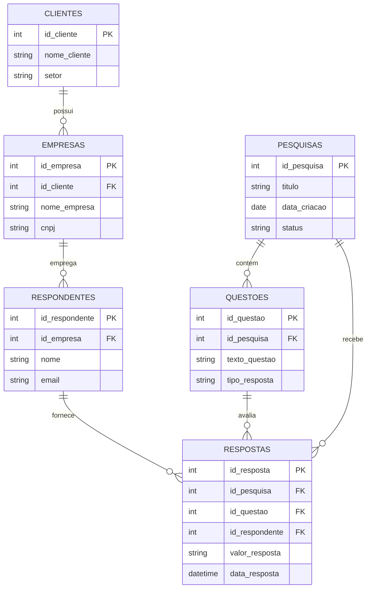

# SPEC-001: Especificação Técnica do Pipeline de Análise Quantitativa e Qualidade de Dados

* **Versão:** 1.0.0
* **Status:** Approved
* **Single Source of Truth (SSoT):** Este documento é a especificação autoritária do pipeline de dados. Qualquer alteração comportamental exige atualização prévia deste documento.

---

## 1. Visão e Escopo

### 1.1 Propósito
O pipeline de análise quantitativa realiza a auditoria de qualidade de dados, o cálculo estatístico descritivo e a modelagem de indicadores sobre a base histórica da Central de Pesquisas do Sidusfarma.

### 1.2 Escopo
* **Incluído:** Processamento integral dos 6 datasets relacionais: `clientes.csv`, `empresas.csv`, `pesquisas.csv`, `questoes.csv`, `respondentes.csv`, `respostas.csv`.
* **Excluído:** Alterações diretas no banco de dados de produção ou criação de tabelas físicas em SGBD (escopo de sprints futuras).

---

## 2. Requisitos Funcionais

| Identificador | Título | Descrição |
| :--- | :--- | :--- |
| **RF-001** | Auditoria DAMA-DMBOK | O sistema deve auditar os 6 datasets nas 6 dimensões DAMA: Completude, Unicidade, Integridade Referencial (FKs), Consistência, Validade e Variância. |
| **RF-002** | Mapeamento de Unidades e Variáveis | O sistema deve definir o grão de cada dataset e classificar 20+ variáveis em: Identificadora, Categórica Nominal, Categórica Ordinal, Numérica Discreta, Numérica Contínua e Temporal. |
| **RF-003** | Estatística Descritiva e Outliers | O sistema deve calcular Média ($\mu$), Mediana ($\tilde{x}$), Moda, Variância ($\sigma^2$), Desvio Padrão ($\sigma$), Coeficiente de Variação ($CV$) e Limites de Outliers via $IQR = Q3 - Q1$ ($LI/LS = Q1/Q3 \pm 1,5 \times IQR$). |
| **RF-004** | Catálogo de Indicadores ($N/D$) | O sistema deve calcular 10+ KPIs de negócio com Fichas Matemáticas explícitas (Numerador, Denominador, Janela Temporal e Filtros). |
| **RF-005** | Sensibilidade por Granularidade | O sistema deve permitir a agregação de indicadores nos níveis Macro (Sidusfarma), Médio (Empresa) e Micro (Pesquisa/Respondente). |

---

## 3. Requisitos Não Funcionais (ISO 25010)

| Identificador | Categoria ISO 25010 | Métrica / Critério de Aceite |
| :--- | :--- | :--- |
| **RNF-001** | Confiabilidade (Reliability) | O pipeline deve tratar 100% das exceções de parsing de tipos ou dados ausentes sem interromper a execução (`Zero-Crash Policy`). |
| **RNF-002** | Desempenho (Performance) | O tempo de execução completo do processamento dos 6 CSVs e geração dos artefatos JSON deve ser $\le 3,0$ segundos. |
| **RNF-003** | Manutenibilidade (Maintainability) | 100% do código deve ser estruturado em módulos independentes com cobertura de testes unitários $\ge 90\%$. |

---

## 4. Contratos de Interface (Schemas JSON)

### 4.1 Contrato de Qualidade: `quality_report.json`
```json
{
  "summary": {
    "total_datasets": 6,
    "overall_completeness_pct": 0.0,
    "total_orphan_records": 0,
    "audit_timestamp": "ISO-8601"
  },
  "datasets": {
    "dataset_name": {
      "row_count": 0,
      "col_count": 0,
      "completeness_by_col": {},
      "duplicate_rows": 0,
      "referential_integrity_errors": {}
    }
  }
}
```

### 4.2 Contrato de Indicadores: `kpis_summary.json`
```json
{
  "kpis": [
    {
      "id": "KPI-01",
      "name": "string",
      "granularity": "string",
      "numerator": "string",
      "denominator": "string",
      "value": 0.0,
      "unit": "percentage | count | days"
    }
  ]
}
```

---

## 5. Modelo de Dados (Mermaid ERD)



---

## 6. Cenários de Teste (BDD / Gherkin)

### Cenário 1: Auditoria de Completude DAMA-DMBOK
* **Dado** que os arquivos CSV das 6 bases são carregados pelo pipeline,
* **Quando** a função `audit_completeness()` for executada,
* **Então** o sistema deve retornar a porcentagem exata de valores nulos por coluna e calcular o percentual de completude global.

### Cenário 2: Validação de Integridade Referencial (Chaves Estrangeiras Órfãs)
* **Dado** a tabela `respostas` com a chave estrangeira `id_respondente`,
* **Quando** for executada a verificação contra a chave primária `id_respondente` da tabela `respondentes`,
* **Então** qualquer registro em `respostas` sem pai em `respondentes` deve ser contabilizado no relatório de erro referencial.

### Cenário 3: Detecção de Outliers pelo Método IQR
* **Dado** uma variável numérica contínua (ex: `tempo_resposta_minutos`),
* **Quando** for calculada a estatística descritiva,
* **Então** o sistema deve definir $IQR = Q3 - Q1$, estabelecer os limites $LI = Q1 - 1,5 \times IQR$ e $LS = Q3 + 1,5 \times IQR$, e sinalizar os registros que excedem esses limites sem excluí-los da base.
