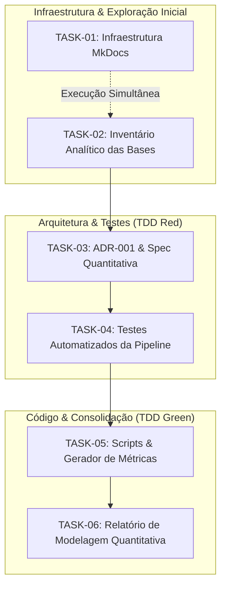

# Índice de Tarefas da Sprint 1 — André Lobo

Este documento define a matriz de execução, fluxo de dependências e critérios de aceite da **Sprint 1** para a **Modelagem Quantitativa dos Dados do Parceiro**, sob a metodologia Spec-Driven Development (SDD) e Test-Driven Development (TDD).

---

## 1. Fluxo Visual de Execução de Tarefas

---

## 2. Matriz de Paralelismo e Dependências

### Descrição de Paralelismo e Bloqueios:
- **Execução em Paralelo (TASK-01 e TASK-02)**: A `TASK-01` (Infraestrutura MkDocs) pode ser desenvolvida simultaneamente com a `TASK-02` (Inventário das Bases), pois a configuração do gerador de documentação não possui dependências com a análise de dados.
- **Trilha Sequencial Analítica (TASK-02 → TASK-03)**: A `TASK-03` (ADR-001 e Especificação Formal) depende diretamente da conclusão da `TASK-02`, pois o modelo matemático exige o catálogo dos schemas das tabelas.
- **Trilha Sequencial de Código TDD (TASK-03 → TASK-04 → TASK-05)**: A `TASK-04` (Testes TDD Red Phase) estabelece os critérios automáticos de aceite a partir da especificação. A `TASK-05` (Scripts de Cálculo/Gráficos) implementa o código necessário para fazer os testes da `TASK-04` passarem (Green Phase).
- **Consolidação Final (TASK-05 → TASK-06)**: A `TASK-06` (Relatório de Modelagem Quantitativa) é a etapa final que documenta os resultados e incorpora os gráficos/KPIs gerados pela `TASK-05`.

---

## 3. Matriz de Detalhamento das Tarefas

| ID | Título da Tarefa | Tipo | Pode em Paralelo? | Depende De | Spec de Referência |
| :--- | :--- | :--- | :--- | :--- | :--- |
| **TASK-01** | Infraestrutura e Configuração MkDocs | Chore | SIM (com TASK-02) | Nenhuma | `docs/specs/tasks/task-01-mkdocs-infra.md` |
| **TASK-02** | Elaboração do Inventário Analítico das Bases | Docs / Math | SIM (com TASK-01) | Nenhuma | `docs/specs/tasks/task-02-inventario.md` |
| **TASK-03** | Arquitetura ADR-001 e Spec Quantitativa | Docs / Spec | NÃO | TASK-02 | `docs/specs/tasks/task-03-specs-adr.md` |
| **TASK-04** | Testes Automatizados da Pipeline (TDD Red) | Test | NÃO | TASK-03 | `docs/specs/tasks/task-04-tdd-tests.md` |
| **TASK-05** | Scripts & Gerador de Métricas (TDD Green) | Feature | NÃO | TASK-04 | `docs/specs/tasks/task-05-scripts.md` |
| **TASK-06** | Relatório de Modelagem Quantitativa | Docs / Math | NÃO | TASK-05 | `docs/specs/tasks/task-06-math-report.md` |

---

## 4. Detalhamento dos Critérios de Aceite

### TASK-01: Configuração do Ambiente de Documentação MkDocs
- **Objetivo**: Configurar o tema Material, plugins de busca e suporte ao MathJax/Mermaid.
- **DoR**: Requisitos de layout e suporte LaTeX definidos.
- **DoD**: Arquivos `mkdocs.yml`, `requirements-docs.txt` e scripts em `docs/javascripts/` funcionais.

### TASK-02: Elaboração do Inventário Analítico das Bases de Dados
- **Objetivo**: Catalogar os dados brutos recebidos em `DADOS/`, mapeando tipos, cardinalidade e nulos.
- **DoR**: Arquivos CSV disponibilizados no projeto.
- **DoD**: Documento `docs/inventario_das_bases.md` concluído com a análise estrutural de todas as tabelas.

### TASK-03: Arquitetura ADR-001 e Especificação Técnica
- **Objetivo**: Formular as hipóteses matemáticas e a arquitetura da pipeline de análise.
- **DoR**: Inventário de dados (TASK-02) finalizado.
- **DoD**: Documentos `spec-analise-quantitativa-dados.md` e `adr-001-pipeline-analise-quantitativa.md` em `docs/specs/`.

### TASK-04: Suíte de Testes Automatizados da Pipeline (TDD Red Phase)
- **Objetivo**: Implementar as asserções de validação de dados e limites de KPI.
- **DoR**: Especificação matemática (TASK-03) concluída.
- **DoD**: Arquivo `tests/test_data_pipeline.py` implementado com suíte pytest pronta.

### TASK-05: Scripts de Processamento e Geração de Métricas (TDD Green Phase)
- **Objetivo**: Implementar o código em Python para processamento de dados e geração de gráficos estatísticos.
- **DoR**: Testes da TASK-04 implementados.
- **DoD**: Scripts `gerar_graficos_relatorio.py`, `gerar_graficos_categoricos.py` e `convert_docs.py` operacionais e com testes passando.

### TASK-06: Relatório Analítico da Modelagem Quantitativa
- **Objetivo**: Redigir o relatório analítico final incorporando a fundamentação teórica e as visualizações geradas.
- **DoR**: Gráficos e métricas geradas via scripts (TASK-05).
- **DoD**: Relatório completo em `docs/modelagem_quantitativa_de_dados_do_parceiro.md` e página `docs/index.md` finalizadas.
